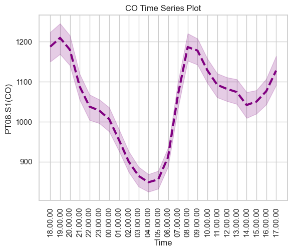

# Gas_Sensors

## Background

Gas sensors are highly integrated environmental sensors combining ambient temperature, absolute humidity, relative humidity and gas measurement in one small package.  They detect a broad range of gases including carbon monoxide, nonmethane hydrocarbons (i.e., ethane, ethene, propane, propene and isoprene), benzene, nitrogen oxide, nitrogen dioxide and ozone for air quality monitoring.

## Data Description

For this project, I used Uc Irvine Machine Learning Repository air quality dataset.  The dataset contains 9358 instances of hourly averaged responses from an array of five metal oxide chemical sensors embedded in an Air Quality Chemical Multisensor Device.  The device was located on the field in a significantly populated area, at road level, within an Italian city.  Data were recorded from March 2004 to February 2005 representing the longest freely available recordings of on field deployed air quality chemical sensors devices responses.  Ground Truth hourly average concentrations for Carbon Dioxide, Non-methane Hydrocarbons, Benzene, Total Nitrogen Oxides (Nox) and Nitrogen Dioxide (NO2) and were provided by a co-located reference certified analyzer.  Evidence of cross-sensitivities, as well as both concept and sensor drifts, are present as described in De Vito et al., Sens. And Act.B, volume 129,2,2008 (citation required) eventually affecting sensors concentration estimation capabilities.  Missing values are tagged with -200 value.

## Capstone Midterm Goals
    • Gather data from multiple sensors and make inferences from the data to determine the safety of the amount of gas/particles dispersed during launches.  
    • Determine the effects of temperature and humidity on gas/particle emission. 
    • Apply skills learned to future projects.

## Describing the Data

N = 9358 instances of hourly averaged responses from an array of five metal oxide chemical sensors
Time (March 2004 – February 2005)
Air Quality Chemical Multisensor Device (five metal oxide chemical sensors)
    • Carbon Dioxide (CO2)
    • Non-Methane Hydrocarbons (NMHC)
    • Nitrogen Oxides (Nox) 
    • Nitrogen Dioxide (NO2)
    • Ozone (O3)

## Data Visualization

Figure 1 shows boxplots of the sensors data which shows the relations between the number of samples taken and outliers.

    

    Figure 1.  Boxplot of the sensors data

Figure 2 shows a heat map relationships between the the sensors, temperature and humidity

    

    Figure 2.  Heat map of sensors

Figure 3 shows time series plot of hourly emission of CO gas.

    

    Figure 3.  CO gas sensor 

Figure 4 shows time series plot of hourly emission of NHMC gas.

    

    Figure 4.  NMHC gas sensor

Figure 5 shows time series plot of hourly emission of NO2 gas.

    

    Figure 5.  NO2 gas sensor

Figure 6 shows time series plot of hourly emission of NOx gas.

    

    Figure 6.  NOx gas sensor

Figure 7 shows time series plot of hourly emission of NOx gas.

    

    Figure 7.  O3 gas sensor

## Future Directions

One future direction is to continue to analyze sensor data.  Multiple sensors are installed throughout the installation.  The data is tracked by multiple databases.  The end goal is to store all the data gathered in a central database.  The data can then be used for predictive analysis to support future launches.

## References

Vito,Saverio. (2016). Air Quality. UCI Machine Learning Repository. https://doi.org/10.24432/C59K5F.